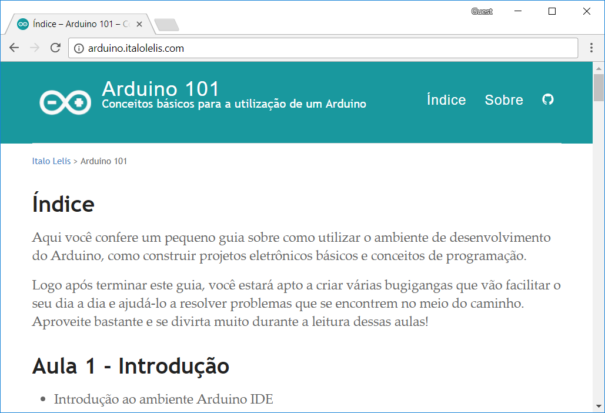

# Arduino 101

O projeto Arduino 101 visa transmitir alguns conhecimentos básicos sobre o manuseio, prototipagem e utilização de um Arduino.

[- Conhecer site do Arduino 101 -](http://arduino.italolelis.com)

## Sobre o Projeto

Trata-se de uma iniciativa sem fins lucrativos, distribuida sobre a [licença do MIT](https://github.com/italohdc/arduino-101/blob/master/LICENSE), criada como um projeto pessoal visando disseminar o conhecimento sobre a plataforma.

Sendo uma iniciativa de código aberto, todos podem contribuir, editar e compartilhar livremente o projeto. Se desejar, pode acessar o [repositório no GitHub](https://github.com/italohdc/arduino-101) para conhecer o código-fonte e realizar alterações.

O site foi desenvolvido em [Jekyll](https://jekyllrb.com/) utilizando como base o tema [Jekyll Now](https://github.com/barryclark/jekyll-now), ambos também distribuídos sobre a [licença do MIT](https://github.com/italohdc/arduino-101/blob/master/LICENSE).

## Contribuidores

  * [Italo Lelis de Carvalho](https://github.com/italohdc)